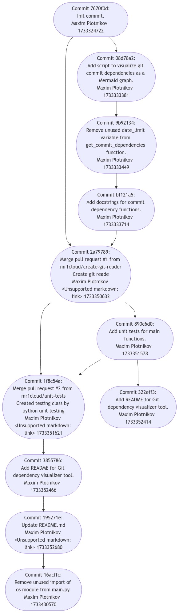

# Визуализатор Git зависимостей графа

Цель: Разработать инструмент командной строки для анализа и визуализации графа зависимостей коммитов в git-репозитории. Граф строится для всех коммитов до указанной даты, отображая файлы и папки, измененные в каждом коммите. Для описания графа используется формат Mermaid с возможностью графического отображения результата.

## Требования:
- Для визуализация трафа использовать Mermaid
- Анализируемый git-репозиторий должен быть доступен локально.

## Тестирование:


# Реализация функций:
1. **`get_commit_dependencies`**: Извлекает информацию о коммитах в указанном git-репозитории, которые были созданы начиная с указанной даты. Для каждого коммита собираются метаданные и измененные файлы.
2. **`generate_mermaid_graph`**: Генерирует Mermaid-скрипт для визуализации графа зависимостей на основе переданных данных о коммитах.
3. **`save_mermaid_graph`**: Сохраняет Mermaid-скрипт в файл.
4. **`convert_mermaid_to_png`**: Конвертирует Mermaid-скрипт в изображение формата PNG.
5. **`main`**: Основная функция, выполняющая следующий алгоритм:

## Функции реализованные для тестирование:
### 1) Проверяет, что функция корректно возвращает зависимости коммитов для указанного репозитория и даты.
```python
def test_get_commit_dependencies(self):
    commits_data = get_commits_with_branches('./.git', '2024-12-04')
    self.assertLess(5, len(commits_data))
```
### Результат:


### 2) Проверяет, что функция корректно формирует граф в формате Mermaid на основе данных о зависимостях.
```python
def test_generate_mermaid_graph(self):
    commits_data = get_commits_with_branches('./.git', '2024-12-04')
    graph = generate_mermaid_graph(commits_data=commits_data)
    self.assertIn('graph TD', graph)
    self.assertIn('195271e', graph)
    self.assertIn('16acffc', graph)
    self.assertIn('2a79789', graph)
```
### Результат:


### 3) Проверяет корректность обработки случая, когда для заданной даты нет подходящих коммитов.
```python
def test_generate_mermaid_graph_empty(self):
    commits_data = get_commits_with_branches('./.git', '2024-12-07')
    graph = generate_mermaid_graph(commits_data=commits_data)
    self.assertEqual(graph, 'graph TD\n')
```
### Результат:


## Результаты тестирование:

